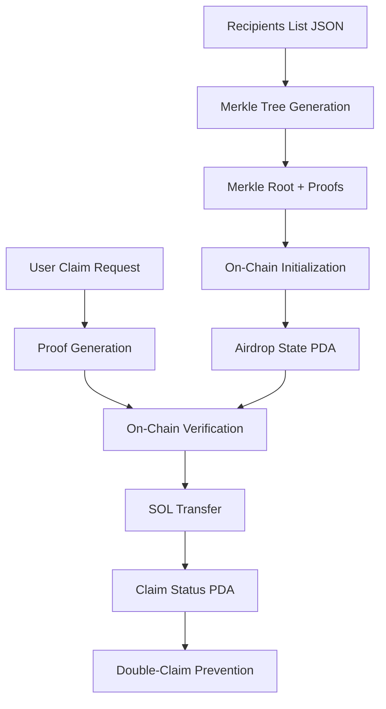

# Comprehensive Technical Guide: Solana Merkle Airdrop Distributor

**A Complete Deep Dive into the Gill + Codama + Anchor Architecture**

## 1. Project Architecture & Overview

### Technology Stack Integration

This project represents a modern approach to Solana airdrop distribution using three key technologies:

#### **Gill (Modern Solana SDK)**
- **Purpose**: Replaces the legacy `@solana/web3.js` with a more modern, type-safe SDK
- **Key Features**:
  - Simplified transaction creation with `createTransaction()`
  - Type-safe address handling with `address()` helper
  - Streamlined key pair management with `createKeyPairSignerFromBytes()`
  - Built-in RPC client abstraction

```typescript
// Example: Creating a Solana client with Gill
const client = createSolanaClient({
  urlOrMoniker: 'devnet' // Simplified network configuration
})
const { rpc, sendAndConfirmTransaction } = client
```

#### **Codama (Client Generation)**
- **Purpose**: Automatically generates type-safe TypeScript clients from Anchor IDL
- **Benefits**:
  - Eliminates manual client code writing
  - Ensures type safety between on-chain program and client
  - Automatic updates when program changes

```typescript
// Auto-generated instruction builders
import { getInitializeAirdropInstruction } from './generated/clients/ts/instructions/initializeAirdrop'
import { getClaimAirdropInstruction } from './generated/clients/ts/instructions/claimAirdrop'
```

#### **Anchor Framework (On-Chain)**
- **Purpose**: Provides Rust framework for Solana program development
- **Features**:
  - Automatic account validation and deserialization
  - Built-in security constraints
  - IDL generation for client tooling

### Data Flow Architecture



### Why This Combination?

1. **Developer Experience**: Gill provides modern JavaScript/TypeScript APIs
2. **Type Safety**: Codama ensures client-program compatibility
3. **Security**: Anchor provides battle-tested on-chain security patterns
4. **Scalability**: Merkle trees enable efficient distribution to thousands of recipients
5. **Cost Efficiency**: Only stores 32-byte root on-chain, not entire recipient list

---

## 2. Merkle Tree Implementation & Cryptography

### Merkle Tree Creation Process

The `GillMerkleTree` class implements a binary Merkle tree optimized for airdrop distribution:

```typescript
export class GillMerkleTree {
  public root: Uint8Array
  private leaves: Uint8Array[]
  private tree: Uint8Array[][]

  constructor(recipients: GillRecipient[]) {
    // Step 1: Create leaf hashes for each recipient
    this.leaves = recipients.map((r) => this.createLeaf(r.recipient, r.amount))
    
    // Step 2: Build tree bottom-up
    this.tree = [this.leaves]
    let currentLevel = this.leaves
    
    // Step 3: Pair and hash until single root
    while (currentLevel.length > 1) {
      const nextLevel: Uint8Array[] = []
      
      for (let i = 0; i < currentLevel.length; i += 2) {
        const left = currentLevel[i]
        const right = i + 1 < currentLevel.length ? currentLevel[i + 1] : left
        const parent = this.hashPair(left, right)
        nextLevel.push(parent)
      }
      
      this.tree.push(nextLevel)
      currentLevel = nextLevel
    }
    
    this.root = currentLevel[0]
  }
}
```

### Leaf Creation Algorithm

The critical leaf encoding must match exactly between client and on-chain verification:

```typescript
private createLeaf(recipient: Address, amount: number): Uint8Array {
  const recipientBytes = bs58.decode(recipient)           // 32 bytes
  const data = Buffer.concat([
    Buffer.from(recipientBytes),                          // recipient_pubkey(32)
    Buffer.from(new Uint8Array(new BigUint64Array([BigInt(amount)]).buffer)), // amount(8) 
    Buffer.from([0]),                                     // isClaimed(1) = false
  ])
  return new Uint8Array(keccak_256.arrayBuffer(data))     // Keccak-256 hash
}
```

**Critical Details:**
- **Recipient**: 32-byte public key (base58 decoded)
- **Amount**: 8-byte little-endian unsigned integer
- **Claimed Flag**: 1-byte boolean (0 = false, 1 = true)
- **Hash Function**: Keccak-256 (NOT SHA-256)

### Why Keccak-256?

1. **Ethereum Compatibility**: Standard in many blockchain applications
2. **Security**: Cryptographically secure with no known vulnerabilities
3. **Performance**: Efficient implementation in both Rust and JavaScript
4. **Solana Support**: Available via `anchor_lang::solana_program::keccak`

### Proof Generation & Verification

#### Client-Side Proof Generation

```typescript
public getProof(leafIndex: number): Uint8Array[] {
  const proof: Uint8Array[] = []
  let index = leafIndex
  
  // Traverse from leaf to root, collecting sibling hashes
  for (let level = 0; level < this.tree.length - 1; level++) {
    const currentLevel = this.tree[level]
    const siblingIndex = index % 2 === 0 ? index + 1 : index - 1
    
    if (siblingIndex < currentLevel.length) {
      proof.push(currentLevel[siblingIndex])
    }
    
    index = Math.floor(index / 2) // Move to parent level
  }
  
  return proof
}
```

#### On-Chain Verification (Rust)

```rust
fn verify_merkle_proof(
    leaf: &[u8; 32],
    proof: &[[u8; 32]],
    leaf_index: u64,
) -> Result<[u8; 32]> {
    let mut computed_hash = *leaf;
    let mut index = leaf_index;

    for proof_element in proof.iter() {
        if index % 2 == 0 {
            // Hash(current computed hash + current element of the proof)
            let mut hash_input = Vec::new();
            hash_input.extend_from_slice(&computed_hash);
            hash_input.extend_from_slice(proof_element);
            computed_hash = keccak::hash(&hash_input).to_bytes();
        } else {
            // Hash(current element of the proof + current computed hash)
            let mut hash_input = Vec::new();
            hash_input.extend_from_slice(proof_element);
            hash_input.extend_from_slice(&computed_hash);
            computed_hash = keccak::hash(&hash_input).to_bytes();
        }
        index /= 2;
    }

    Ok(computed_hash)
}
```

**Critical Consistency Requirements:**
1. **Leaf Index**: Must match recipient's position in original array
2. **Proof Order**: Sibling hashes in correct traversal order
3. **Hash Order**: Left/right concatenation must match tree construction
4. **Encoding**: Exact byte representation between client and on-chain

---

## 3. On-Chain Program Deep Dive

### Account Structure Analysis

#### AirdropState PDA

```rust
#[account]
pub struct AirdropState {
    /// The Merkle root of the airdrop (32 bytes)
    pub merkle_root: [u8; 32],
    /// The authority allowed to update the merkle root
    pub authority: Pubkey,
    /// Total SOL allocated for this airdrop (in lamports)
    pub airdrop_amount: u64,
    /// Total SOL claimed so far (in lamports)
    pub amount_claimed: u64,
    /// Bump seed for the PDA
    pub bump: u8,
}
```

**PDA Derivation:**
- **Seeds**: `["merkle_tree"]`
- **Space**: `8 + 32 + 32 + 8 + 8 + 1 = 89 bytes` (Anchor adds 8-byte discriminator)
- **Purpose**: Stores immutable airdrop parameters and tracks distribution progress

#### ClaimStatus PDA

```rust
#[account]
pub struct ClaimStatus {}
```

**PDA Derivation:**
- **Seeds**: `["claim", airdrop_state.key(), recipient.key()]`
- **Space**: `8 bytes` (minimal - existence indicates claimed)
- **Purpose**: Prevents double-claiming by creating unique account per recipient

#### Vault Functionality

The airdrop state account itself serves as the vault:
- **SOL Storage**: Holds all lamports for distribution
- **Access Control**: Only program can move funds via CPI
- **Accounting**: Tracks total allocated vs. claimed amounts

### Instruction Breakdown

#### Initialize Airdrop

```rust
pub fn initialize_airdrop(
    ctx: Context<Initialize>,
    merkle_root: [u8; 32],
    amount: u64,
) -> Result<()> {
    let airdrop_state = &mut ctx.accounts.airdrop_state;
    
    // Set immutable parameters
    airdrop_state.merkle_root = merkle_root;
    airdrop_state.authority = ctx.accounts.authority.key();
    airdrop_state.airdrop_amount = amount;
    airdrop_state.amount_claimed = 0;
    airdrop_state.bump = ctx.bumps.airdrop_state;

    // Transfer SOL to vault (the airdrop_state account itself)
    let transfer_ix = anchor_lang::solana_program::system_instruction::transfer(
        &ctx.accounts.authority.key(),
        &airdrop_state.key(),
        amount,
    );

    anchor_lang::solana_program::program::invoke(
        &transfer_ix,
        &[
            ctx.accounts.authority.to_account_info(),
            airdrop_state.to_account_info(),
            ctx.accounts.system_program.to_account_info(),
        ],
    )?;

    Ok(())
}
```

**Account Constraints:**
```rust
#[derive(Accounts)]
pub struct Initialize<'info> {
    #[account(
        init,
        seeds = [b"merkle_tree"],
        bump,
        payer = authority,
        space = 8 + std::mem::size_of::<AirdropState>()
    )]
    pub airdrop_state: Account<'info, AirdropState>,

    #[account(mut)]
    pub authority: Signer<'info>,

    pub system_program: Program<'info, System>,
}
```

#### Claim Airdrop

```rust
pub fn claim_airdrop(
    ctx: Context<Claim>,
    amount: u64,
    proof: Vec<[u8; 32]>,
    leaf_index: u64,
) -> Result<()> {
    let airdrop_state = &mut ctx.accounts.airdrop_state;
    let signer = &ctx.accounts.signer;

    // Step 1: Recreate leaf hash
    let mut leaf_data = Vec::new();
    leaf_data.extend_from_slice(&signer.key().to_bytes());
    leaf_data.extend_from_slice(&amount.to_le_bytes());
    leaf_data.push(0u8); // isClaimed flag (0 = false)
    
    let leaf_hash = keccak::hash(&leaf_data).to_bytes();

    // Step 2: Verify Merkle proof
    let computed_root = verify_merkle_proof(&leaf_hash, &proof, leaf_index)?;
    
    require!(
        computed_root == airdrop_state.merkle_root,
        ErrorCode::InvalidProof
    );

    // Step 3: Transfer SOL
    **airdrop_state.to_account_info().try_borrow_mut_lamports()? -= amount;
    **ctx.accounts.signer.to_account_info().try_borrow_mut_lamports()? += amount;

    // Step 4: Update accounting
    airdrop_state.amount_claimed = airdrop_state.amount_claimed.saturating_add(amount);

    Ok(())
}
```

**Account Constraints:**
```rust
#[derive(Accounts)]
pub struct Claim<'info> {
    #[account(
        mut,
        seeds = [b"merkle_tree"],
        bump = airdrop_state.bump
    )]
    pub airdrop_state: Account<'info, AirdropState>,

    #[account(
        init,
        payer = signer,
        space = 8,
        seeds = [b"claim", airdrop_state.key().as_ref(), signer.key().as_ref()],
        bump
    )]
    pub user_claim: Account<'info, ClaimStatus>,

    #[account(mut)]
    pub signer: Signer<'info>,

    pub system_program: Program<'info, System>,
}
```

### Security Mechanisms

#### PDA-Based Access Control

1. **Deterministic Addresses**: PDAs prevent address spoofing
2. **Seed-Based Validation**: Specific seeds ensure correct account relationships
3. **Bump Verification**: Canonical bump prevents alternative derivations

#### Double-Claim Prevention

```rust
#[account(
    init,  // Fails if account already exists
    payer = signer,
    space = 8,
    seeds = [b"claim", airdrop_state.key().as_ref(), signer.key().as_ref()],
    bump
)]
pub user_claim: Account<'info, ClaimStatus>,
```

The `init` constraint ensures the claim status account can only be created once per recipient.

#### Lamport Accounting

```rust
// Saturating arithmetic prevents overflow/underflow
airdrop_state.amount_claimed = airdrop_state.amount_claimed.saturating_add(amount);
```

#### Authority Validation

```rust
require!(
    ctx.accounts.authority.key() == airdrop_state.authority,
    ErrorCode::Unauthorized
);
```

---

## 4. Participant Verification & Eligibility

### Recipient List Management

#### Recipients.json Structure

```typescript
interface RecipientsFile {
  airdropId: string
  description: string
  merkleRoot: string           // Computed from recipients
  totalAmount: string          // Sum of all amounts
  network: string              // Target network
  programId: string            // Deployed program address
  recipients: RecipientFromJson[]
  metadata: {
    createdAt: string          // Generation timestamp
    version: string            // Schema version
    algorithm: string          // "keccak256"
    leafFormat: string         // Encoding specification
  }
}
```

#### Automatic Test Wallet Generation

The setup process creates test wallets automatically:

```typescript
export async function generateGillTestWallets(
  rpc: any,
  count: number
): Promise<GillWalletInfo[]> {
  const wallets: GillWalletInfo[] = []
  
  for (let i = 1; i <= count; i++) {
    const signer = await generateKeyPairSigner()
    
    const walletInfo: GillWalletInfo = {
      name: `test-wallet-${i}`,
      address: signer.address,
      keypairFile: `./test-wallet-${i}.json`,
      privateKey: {
        hex: '0x' + Buffer.from(signer.keyPair.privateKey).toString('hex'),
        base58: bs58.encode(signer.keyPair.privateKey),
        array: Array.from(signer.keyPair.privateKey)
      },
      // ... additional fields
      signer
    }
    
    wallets.push(walletInfo)
  }
  
  return wallets
}
```

### Claim Eligibility Verification

#### Client-Side Eligibility Check

```typescript
export function generateProofForRecipient(recipientAddress: string): {
  proof: string[]
  amount: string
  leafIndex: number
  recipient: string
} | null {
  // Find recipient in the data
  const recipient = RECIPIENTS_DATA.recipients.find(
    r => r.publicKey === recipientAddress
  )
  
  if (!recipient) {
    return null // Not eligible
  }
  
  // Generate Merkle proof
  const merkleTree = new GillMerkleTree(/* recipients data */)
  const proofResult = generateGillProof(merkleTree, recipient.index)
  
  return {
    proof: proofResult.proof,
    amount: recipient.amount,
    leafIndex: recipient.index,
    recipient: recipient.publicKey
  }
}
```

#### Balance Requirements

```typescript
const minBalanceLamports = AIRDROP_CONFIG.MIN_SOL_BALANCE * 1e9
if (balanceLamports < minBalanceLamports) {
  throw new Error(
    `Insufficient SOL balance: ${balanceLamports / 1e9} SOL. ` +
    `Need at least ${AIRDROP_CONFIG.MIN_SOL_BALANCE} SOL for transaction fees.`
  )
}
```

### Metadata Tracking

The system tracks comprehensive metadata for audit and debugging:

```typescript
metadata: {
  createdAt: "2025-08-14T13:47:28.327Z",
  version: "1.0.0",
  algorithm: "keccak256",
  leafFormat: "recipient_pubkey(32) + amount(8) + is_claimed(1)"
}
```

---

## 5. Identity & Ownership Verification

### Cryptographic Proof of Ownership

#### Solana's Built-in Signature Verification

Every transaction requires the recipient to sign with their private key:

```typescript
const transaction = createTransaction({
  version: 'legacy',
  feePayer: signer,  // Must own private key
  instructions: [claimInstruction],
  latestBlockhash,
})

// Signing happens automatically in sendAndConfirmTransaction
const signature = await sendAndConfirmTransaction(transaction)
```

#### On-Chain Signer Validation

```rust
#[account(mut)]
pub signer: Signer<'info>,  // Anchor validates signature
```

The `Signer<'info>` constraint ensures:
1. Transaction is signed by the specified account
2. Private key ownership is cryptographically proven
3. No one else can claim on behalf of the recipient

### Anti-Fraud Mechanisms

#### Unique PDA Generation

Each recipient gets a unique claim status PDA:

```rust
seeds = [b"claim", airdrop_state.key().as_ref(), signer.key().as_ref()]
```

This prevents:
- **Replay Attacks**: Same proof can't be used twice
- **Cross-Recipient Claims**: Can't use another's proof
- **Program Spoofing**: PDA tied to specific program

#### Immutable Merkle Root

```rust
airdrop_state.merkle_root = merkle_root; // Set once during initialization
```

Once set, the recipient set cannot be modified, preventing:
- **Post-hoc Additions**: No new recipients after initialization
- **Eligibility Tampering**: Can't modify amounts or addresses
- **Root Manipulation**: Cryptographic integrity maintained

#### On-Chain State Tracking

```rust
pub amount_claimed: u64,  // Cumulative tracking
```

Enables:
- **Distribution Monitoring**: Track total claimed vs allocated
- **Audit Trail**: On-chain record of all claims
- **Completion Detection**: Know when distribution is finished

---

## 6. Tooling & Development Workflow

### Codama Integration

#### IDL to Client Generation

```typescript
// codama.config.ts
import { createFromRoot } from 'codama'
import { rootNodeFromAnchor } from '@codama/nodes-from-anchor'
import { renderJavaScriptVisitor } from '@codama/renderers'

async function generateClients() {
  // Convert Anchor IDL to Codama tree
  const codama = createFromRoot(rootNodeFromAnchor(anchorIdl as AnchorIdl))
  
  // Generate TypeScript client
  await visit(codama.getRoot(), await renderJavaScriptVisitor(outputDir))
}
```

#### Generated Type-Safe Instruction Builders

```typescript
// Auto-generated: anchor/generated/clients/ts/instructions/initializeAirdrop.ts
export function getInitializeAirdropInstruction(input: {
  airdropState: Address | TransactionSigner
  authority: TransactionSigner
  merkleRoot: Uint8Array
  amount: bigint
}): TransactionInstruction {
  // Type-safe instruction building
  // Automatic account ordering
  // Built-in constraint validation
}
```

#### Generated Account Deserializers

```typescript
// Auto-generated: anchor/generated/clients/ts/accounts/airdropState.ts
export async function fetchAirdropState(
  rpc: Rpc<GetAccountInfoApi>,
  address: Address
): Promise<Account<AirdropState> | null> {
  // Automatic deserialization
  // Type-safe data access
  // Error handling
}
```

### Gill SDK Usage

#### Modern Transaction Creation

```typescript
import { createTransaction, createKeyPairSignerFromBytes } from 'gill'

const transaction = createTransaction({
  version: 'legacy',
  feePayer: signer,
  instructions: [initializeInstruction],
  latestBlockhash,
})
```

**Benefits over Legacy SDK:**
- Cleaner API surface
- Better TypeScript support
- Simplified error handling
- Modern async/await patterns

#### PDA Derivation

```typescript
import { getProgramDerivedAddress } from 'gill'

const [airdropStatePda] = await getProgramDerivedAddress({
  programAddress,
  seeds: ['merkle_tree'],
})
```

#### Network Abstraction

```typescript
const client = createSolanaClient({
  urlOrMoniker: 'devnet' // Simple network selection
})
```

### Build & Deployment Scripts

#### Complete Setup Workflow

```typescript
// anchor/scripts/deploy-setup.ts
export async function runGillDeploymentSetup() {
  // 1. Create/import deployment wallet
  const deployWallet = await setupGillDeployWallet(rl, config)
  
  // 2. Generate test wallets
  const testWallets = await setupGillTestWallets(rl, config)
  
  // 3. Deploy program (optional)
  if (shouldDeploy) {
    await completeGillSetup({
      deployProgram: true,
      generateNewProgramId: generateNewProgram,
      // ...
    })
  }
  
  // 4. Update configuration files
  // 5. Generate Merkle tree
  // 6. Create recipients.json
}
```

#### Automatic Program ID Management

```typescript
// codama.config.ts
async function generateProgramId(): Promise<string> {
  // Generate new keypair
  execSync(`solana-keygen new --no-bip39-passphrase --silent --outfile ${keypairPath}`)
  
  // Get public key
  const programId = execSync(`solana-keygen pubkey ${keypairPath}`, { encoding: 'utf8' }).trim()
  
  // Update lib.rs
  libRsContent = libRsContent.replace(/declare_id!\(".*"\);/, `declare_id!("${programId}");`)
  
  // Update Anchor.toml
  anchorTomlContent = anchorTomlContent.replace(/solana_distributor = ".*"/, `solana_distributor = "${programId}"`)
  
  return programId
}
```

#### Client Regeneration

```typescript
// Automatic sync after program changes
const codamaSynced = await ensureGillCodamaSync({ workingDir })
if (!codamaSynced) {
  console.log('⚠️  Warning: Could not sync Codama client')
}
```

---

## 7. Frontend Integration & User Experience

### Claim Flow Implementation

#### React Hook for Airdrop Claims

```typescript
// src/hooks/useAirdropClaim.ts
export function useAirdropClaim(): UseAirdropClaimResult {
  const [isLoading, setIsLoading] = useState(false)
  const [status, setStatus] = useState('')

  const handleClaimAirdrop = async () => {
    setIsLoading(true)
    setStatus('Initializing...')

    try {
      // 1. Validate configuration
      validateConfig()

      // 2. Check if already claimed
      setStatus('Checking if airdrop has already been claimed...')
      const alreadyClaimed = await checkClaimStatus(config, privateKey)
      if (alreadyClaimed) {
        setStatus('Already claimed')
        return
      }

      // 3. Execute claim
      setStatus('Claiming airdrop...')
      const result = await claimAirdrop(config, privateKey)
      
      setStatus('Success!')
      // Show success UI
      
    } catch (error) {
      setStatus('Error occurred')
      // Handle error
    } finally {
      setIsLoading(false)
    }
  }

  return { isLoading, status, handleClaimAirdrop }
}
```

#### Claim Button Component

```typescript
// src/components/claim-button.tsx
export const ClaimButton = () => {
  const { isLoading, status, handleClaimAirdrop } = useAirdropClaim()

  return (
    <div className="flex flex-col items-center gap-4 p-6">
      <h2 className="text-2xl font-bold">Airdrop Claim</h2>

      {status && (
        <div className="text-sm text-gray-600 bg-gray-100 px-3 py-2 rounded">
          {status}
        </div>
      )}

      <button
        onClick={handleClaimAirdrop}
        disabled={isLoading}
        className={`px-6 py-3 rounded-lg font-medium transition-colors ${
          isLoading 
            ? 'bg-gray-300 text-gray-500 cursor-not-allowed' 
            : 'bg-blue-500 text-white hover:bg-blue-600'
        }`}
      >
        {isLoading ? 'Claiming...' : 'Claim Airdrop'}
      </button>
    </div>
  )
}
```

### State Management

#### Claim Status Checking

```typescript
export async function checkClaimStatus(
  config: AirdropClaimConfig, 
  privateKey: string
): Promise<boolean> {
  const clientInstance = createClientInstance(config.network)
  const signer = await createKeyPairSignerFromBytes(bs58.decode(privateKey))

  // Derive claim status PDA
  const [userClaimPda] = await getProgramDerivedAddress({
    programAddress,
    seeds: ['claim', bs58.decode(airdropStatePda), bs58.decode(signer.address)],
  })

  try {
    const accountInfo = await clientInstance.rpc.getAccountInfo(address(userClaimPda)).send()
    return accountInfo.value !== null // Account exists = claimed
  } catch {
    return false
  }
}
```

#### Transaction Execution

```typescript
async function sendClaimTransaction(clientInstance, params) {
  const { signer, programAddress, airdropStatePda, userClaimPda, proof } = params

  // Serialize instruction data
  const instructionData = serializeClaimInstructionData({
    amount: proof.amount,
    proof: proof.proof,
    leafIndex: proof.leafIndex,
  })

  // Create transaction
  const transaction = createTransaction({
    version: 'legacy',
    feePayer: signer,
    instructions: [{
      programAddress,
      accounts: [
        { address: address(airdropStatePda), role: ACCOUNT_ROLES.WRITABLE },
        { address: address(userClaimPda), role: ACCOUNT_ROLES.WRITABLE },
        { address: signer.address, role: ACCOUNT_ROLES.WRITABLE_SIGNER },
        { address: address(PROGRAM_ADDRESSES.SYSTEM_PROGRAM), role: ACCOUNT_ROLES.READONLY },
      ],
      data: instructionData,
    }],
    latestBlockhash,
  })

  return await clientInstance.sendAndConfirmTransaction(transaction)
}
```

### Error Handling & User Feedback

#### Comprehensive Error Messages

```typescript
if (!proof) {
  throw new Error(`Address ${signer.address} is not eligible for this airdrop`)
}

if (balanceLamports < minBalanceLamports) {
  throw new Error(
    `Insufficient SOL balance: ${balanceLamports / 1e9} SOL. ` +
    `Need at least ${AIRDROP_CONFIG.MIN_SOL_BALANCE} SOL for transaction fees.`
  )
}

if (alreadyClaimed) {
  throw new Error('Airdrop has already been claimed for this address')
}
```

#### Real-time Status Updates

```typescript
setStatus('Checking if airdrop has already been claimed...')
// ... check claim status

setStatus('Claiming airdrop...')
// ... execute transaction

setStatus('Success!')
// ... show success message
```

---

## 8. Testing & Validation Strategy

### Comprehensive Test Coverage

#### End-to-End Integration Tests

```typescript
// anchor/tests/solana-distributor-comprehensive.test.ts
describe('Solana Distributor (Comprehensive Gill + Codama)', () => {
  let client: ReturnType<typeof createSolanaClient>
  let authority: TransactionSigner
  let recipient1: TransactionSigner
  let recipient2: TransactionSigner
  let merkleTreeResult: { merkleRoot: string; merkleTree: GillMerkleTree }

  beforeAll(async () => {
    // Setup test environment
    client = createSolanaClient({ urlOrMoniker: 'devnet' })
    
    // Load deployment wallet
    const walletData = fs.readFileSync('./deploy-wallet.json', 'utf8')
    authority = await createKeyPairSignerFromBytes(new Uint8Array(JSON.parse(walletData)))
    
    // Generate test recipients
    recipient1 = await generateKeyPairSigner()
    recipient2 = await generateKeyPairSigner()
    
    // Fund test accounts
    await rpc.requestAirdrop(recipient1.address, lamports(10000000n)).send()
    await rpc.requestAirdrop(recipient2.address, lamports(10000000n)).send()
    
    // Generate Merkle tree
    merkleTreeResult = generateGillMerkleTree(recipientsData)
  })
})
```

#### Unit Tests for Merkle Operations

```typescript
test('Initialize airdrop with Merkle tree (Gill + Codama)', async () => {
  const initializeInstruction = getInitializeAirdropInstruction({
    airdropState: airdropStatePda,
    authority: authority,
    merkleRoot: new Uint8Array(merkleTreeResult.merkleTree.root),
    amount: BigInt(totalAmount),
  })

  const transaction = createTransaction({
    version: 'legacy',
    feePayer: authority,
    instructions: [initializeInstruction],
    latestBlockhash,
  })

  const signature = await sendAndConfirmTransaction(transaction)
  
  // Verify state
  const airdropState = await fetchAirdropState(rpc, airdropStatePda)
  expect(airdropState!.data.merkleRoot).toEqual(Array.from(merkleTreeResult.merkleTree.root))
  expect(Number(airdropState!.data.airdropAmount)).toBe(totalAmount)
})
```

#### Claim Validation Tests

```typescript
test('Claim SOL - Recipient 1 (Gill + Codama)', async () => {
  // Generate proof
  const proofResult = generateGillProof(merkleTreeResult.merkleTree, 0)
  
  // Check balance before
  const balanceBefore = await rpc.getBalance(recipient1.address).send()
  
  // Execute claim
  const claimInstruction = getClaimAirdropInstruction({
    airdropState: airdropStatePda,
    userClaim: address(claimStatusPda),
    signer: recipient1,
    proof: proofResult.proof.map(p => new Uint8Array(Buffer.from(p.slice(2), 'hex'))),
    amount: BigInt(recipient1Amount),
    leafIndex: 0,
  })
  
  const signature = await sendAndConfirmTransaction(transaction)
  
  // Verify balance increase
  const balanceAfter = await rpc.getBalance(recipient1.address).send()
  const balanceIncrease = Number(balanceAfter.value) - Number(balanceBefore.value)
  expect(balanceIncrease).toBeCloseTo(recipient1Amount, -5)
  
  // Verify claim status created
  const claimStatus = await fetchClaimStatus(rpc, address(claimStatusPda))
  expect(claimStatus).toBeTruthy()
})
```

#### Error Case Testing

```typescript
test('Should fail to claim twice (Gill + Codama)', async () => {
  const proofResult = generateGillProof(merkleTreeResult.merkleTree, 0)
  
  const claimInstruction = getClaimAirdropInstruction({
    // ... same parameters as successful claim
  })
  
  const transaction = createTransaction({
    version: 'legacy',
    feePayer: recipient1,
    instructions: [claimInstruction],
    latestBlockhash,
  })
  
  // Should fail because claim status account already exists
  await expect(sendAndConfirmTransaction(transaction)).rejects.toThrow()
})
```

### Validation Strategies

#### Merkle Tree Consistency

```typescript
// Verify client and on-chain proof verification match
function verifyProofConsistency(proof: string[], leaf: string, root: string): boolean {
  let computedHash = Buffer.from(leaf.replace('0x', ''), 'hex')
  
  for (const proofElement of proof) {
    const proofBuf = Buffer.from(proofElement.replace('0x', ''), 'hex')
    
    if (Buffer.compare(computedHash, proofBuf) < 0) {
      computedHash = Buffer.from(keccak_256.arrayBuffer(Buffer.concat([computedHash, proofBuf])))
    } else {
      computedHash = Buffer.from(keccak_256.arrayBuffer(Buffer.concat([proofBuf, computedHash])))
    }
  }
  
  return '0x' + computedHash.toString('hex') === root
}
```

#### Account State Verification

```typescript
// Verify PDA derivation matches expected seeds
const [expectedPda] = await getProgramDerivedAddress({
  programAddress: SOLANA_DISTRIBUTOR_PROGRAM_ADDRESS,
  seeds: ['merkle_tree'],
})
expect(airdropStatePda).toBe(expectedPda)
```

---

## 9. Security Considerations & Best Practices

### Common Pitfalls & Solutions

#### Proof Mismatch Issues

**Problem**: Client and on-chain verification disagree

**Causes**:
1. Different leaf encoding (byte order, field order)
2. Different hash functions (SHA-256 vs Keccak-256)
3. Incorrect proof order or tree construction

**Solution**:
```typescript
// Ensure exact matching between client and on-chain
const createLeafHash = (recipient: Address, amount: number, isClaimed: boolean = false): string => {
  const recipientBytes = bs58.decode(recipient)
  const data = Buffer.concat([
    Buffer.from(recipientBytes),                                    // 32 bytes
    Buffer.from(new Uint8Array(new BigUint64Array([BigInt(amount)]).buffer)), // 8 bytes LE
    Buffer.from([isClaimed ? 1 : 0]),                              // 1 byte
  ])
  return '0x' + Buffer.from(keccak_256.arrayBuffer(data)).toString('hex')
}
```

#### Program ID Consistency

**Problem**: Deployed program ID differs from client expectations

**Solution**: Automatic synchronization
```typescript
async function ensureGillProgramIdConsistency(
  newProgramId?: string,
  config: GillBuildConfig = {}
): Promise<boolean> {
  const { workingDir = '.' } = config
  
  // Get current program ID from lib.rs
  const libRsPath = path.join(workingDir, 'programs', 'solana-distributor', 'src', 'lib.rs')
  const libRsContent = fs.readFileSync(libRsPath, 'utf8')
  const currentMatch = libRsContent.match(/declare_id!\("(.*)"\);/)
  
  // Update if different
  if (newProgramId && currentMatch && currentMatch[1] !== newProgramId) {
    // Update lib.rs, Anchor.toml, and regenerate client
    return await updateProgramIdEverywhere(newProgramId, config)
  }
  
  return true
}
```

### Production Deployment Considerations

#### Upgrade Authority Management

```rust
// Consider making program immutable for security
// anchor upgrade --program-id <PROGRAM_ID> --buffer <BUFFER> --authority <AUTHORITY>
```

**Recommendations**:
1. **Testing Phase**: Keep upgrade authority for bug fixes
2. **Production**: Transfer to multisig or make immutable
3. **Documentation**: Clear upgrade/immutability policy

#### Compute Budget Considerations

```typescript
// For large recipient sets, monitor compute usage
const computeBudgetIx = ComputeBudgetProgram.setComputeUnitLimit({
  units: 300_000, // Adjust based on proof depth
})

const transaction = createTransaction({
  instructions: [computeBudgetIx, claimInstruction],
  // ...
})
```

**Guidelines**:
- **Proof Depth**: ~200 CU per proof element
- **Max Recipients**: ~10,000 for single transaction
- **Larger Sets**: Consider multiple distributions

#### Transaction Size Limits

**Solana Limits**:
- Max transaction size: 1232 bytes
- Max accounts: 64 per transaction
- Max instruction data: ~1000 bytes

**For Large Proofs**:
```typescript
if (proof.length > 15) {
  throw new Error('Proof too large for single transaction. Consider splitting distribution.')
}
```

### Security Audit Checklist

#### Smart Contract Security

- [ ] **Integer Overflow**: Use saturating arithmetic
- [ ] **Access Control**: Verify authority checks
- [ ] **PDA Security**: Correct seed derivation
- [ ] **Account Validation**: Proper constraints
- [ ] **Reentrancy**: Not applicable (no external calls)

#### Cryptographic Security

- [ ] **Hash Function**: Keccak-256 consistency
- [ ] **Leaf Encoding**: Exact byte-level matching
- [ ] **Proof Order**: Consistent tree traversal
- [ ] **Root Immutability**: Cannot be changed post-init

#### Operational Security

- [ ] **Key Management**: Secure authority key storage
- [ ] **Network Security**: Proper RPC endpoint validation
- [ ] **Environment Variables**: Secure secret handling
- [ ] **Monitoring**: Transaction and balance tracking

---

## 10. Operational Procedures

### Setup & Initialization Process

#### Step-by-Step Deployment

```bash
# 1. Clone and install
git clone <repository>
cd gill-jito-airdrop
pnpm install

# 2. Generate TypeScript clients
pnpm codama:generate

# 3. Interactive setup (creates wallets, deploys program)
pnpm airdrop:setup

# 4. Initialize airdrop state on-chain
pnpm airdrop:init

# 5. Start frontend
pnpm dev
```

#### Environment Configuration

```typescript
// .env.local (automatically created by setup)
NEXT_PUBLIC_PROGRAM_ID=AV6HAHbuAxV5hgjF6qGNaYeAhmYZNWKDhi3pdr6wkDXr
NEXT_PUBLIC_SOLANA_NETWORK=devnet
USER_PRIVATE_KEY=base58_encoded_private_key
```

#### Key Management Best Practices

```typescript
// Development: Use environment variables
const privateKey = process.env.USER_PRIVATE_KEY

// Production: Use secure key management
// - Hardware wallets (Ledger, Trezor)
// - Key management services (AWS KMS, HashiCorp Vault)
// - Multisig wallets
```

### Monitoring & Maintenance

#### Tracking Claim Progress

```typescript
async function getAirdropProgress(): Promise<{
  totalAmount: number
  claimedAmount: number
  remainingAmount: number
  percentComplete: number
}> {
  const airdropState = await fetchAirdropState(rpc, airdropStatePda)
  
  if (!airdropState) {
    throw new Error('Airdrop not initialized')
  }
  
  const totalAmount = Number(airdropState.data.airdropAmount)
  const claimedAmount = Number(airdropState.data.amountClaimed)
  const remainingAmount = totalAmount - claimedAmount
  const percentComplete = (claimedAmount / totalAmount) * 100
  
  return { totalAmount, claimedAmount, remainingAmount, percentComplete }
}
```

#### Balance Monitoring

```typescript
async function monitorVaultBalance(): Promise<void> {
  const balance = await rpc.getBalance(airdropStatePda).send()
  const balanceSOL = Number(balance.value) / 1e9
  
  console.log(`Vault Balance: ${balanceSOL} SOL`)
  
  if (balanceSOL < 0.1) {
    console.warn('⚠️  Low vault balance detected!')
  }
}
```

#### Error Handling & Support

```typescript
// Common error scenarios and solutions
const ERROR_SOLUTIONS = {
  'Address not eligible': 'Recipient not in original list',
  'Already claimed': 'Double-claim prevention worked',
  'Invalid proof': 'Merkle proof verification failed - check tree generation',
  'Insufficient funds': 'Vault needs more SOL or recipient needs transaction fees',
  'Program ID mismatch': 'Client out of sync - regenerate with pnpm codama:generate'
}
```

### Merkle Root Updates

#### Adding New Recipients

```typescript
// Note: This requires update_merkle_root instruction
async function updateAirdropRecipients(
  newRecipients: GillRecipient[],
  additionalSOL: number
): Promise<void> {
  // 1. Generate new Merkle tree
  const newMerkleTree = new GillMerkleTree(newRecipients)
  
  // 2. Call update instruction
  const updateInstruction = getUpdateMerkleRootInstruction({
    airdropState: airdropStatePda,
    authority: authoritySigner,
    newMerkleRoot: new Uint8Array(newMerkleTree.root),
    additionalAmount: BigInt(additionalSOL * 1e9),
  })
  
  // 3. Execute transaction
  const signature = await sendAndConfirmTransaction(transaction)
  
  // 4. Update recipients.json file
  // 5. Regenerate client with new data
}
```

**Important**: This invalidates existing unclaimed proofs!

### Production Checklist

#### Pre-Launch

- [ ] **Security Audit**: Third-party code review
- [ ] **Load Testing**: Test with realistic recipient counts
- [ ] **Network Testing**: Verify on target network (mainnet/devnet)
- [ ] **Key Security**: Secure authority key storage
- [ ] **Monitoring**: Set up balance and progress tracking
- [ ] **Documentation**: User guides and troubleshooting

#### Launch Day

- [ ] **Final Testing**: Verify all systems operational
- [ ] **Recipient Notification**: Announce airdrop availability
- [ ] **Support Preparation**: Ready for user questions
- [ ] **Monitoring**: Watch for unusual activity or errors

#### Post-Launch

- [ ] **Progress Tracking**: Regular balance and claim monitoring
- [ ] **User Support**: Handle eligibility and technical questions
- [ ] **Security Monitoring**: Watch for suspicious activity
- [ ] **Completion Planning**: Handle remaining funds and closure

---

## Conclusion

This comprehensive guide covers the complete technical implementation of the Solana Merkle Airdrop Distributor using modern tooling. The combination of Gill, Codama, and Anchor provides a robust, secure, and developer-friendly approach to large-scale token distribution.

### Key Takeaways

1. **Merkle Trees**: Enable efficient, scalable airdrops with cryptographic proof
2. **Modern Tooling**: Gill + Codama + Anchor provide excellent developer experience
3. **Security First**: Multiple layers of protection against common attack vectors
4. **Type Safety**: Generated clients ensure consistency between on-chain and off-chain code
5. **Operational Excellence**: Comprehensive testing, monitoring, and maintenance procedures

### Next Steps

- Customize recipient lists for your specific use case
- Adapt the frontend for your brand and user experience
- Consider additional features like vesting or multiple token types
- Plan for scaling to larger recipient sets if needed

For questions or contributions, refer to the project repository and documentation.

---

*This guide represents a complete technical reference for implementing and operating Solana airdrop systems using modern best practices and tooling.*
